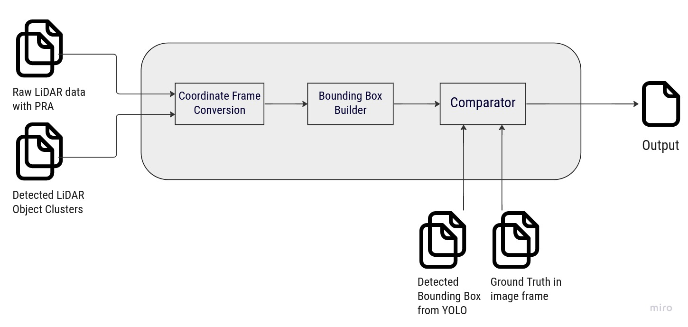
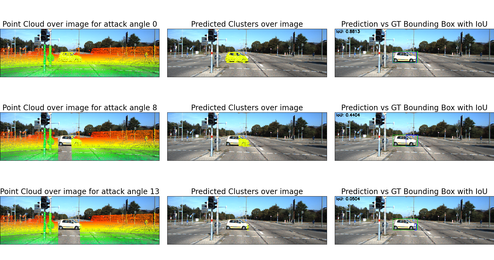
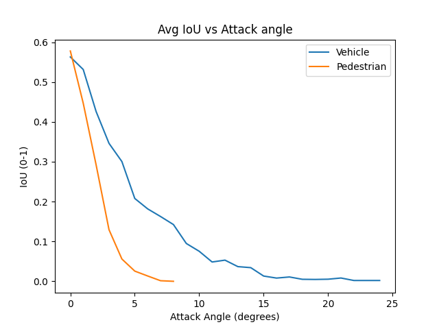

# ROS File Analysis
Perception is a crucial component of autonomous vehicles (AVs), using sensors such as cameras and LiDARs to understand the driving environment. Previous research has focused on the security of perception systems due to their impact on road safety. In this project, we propose a pipeline for analyzing data in the event of a physical removal attack (PRA) on an AV system. PRA is a laser-based spoofing technique that selectively removes LiDAR point cloud data of genuine obstacles at the LiDAR sensor level effectively creating gaps in the data. The aim of our pipeline is to automatically compute and visualize the variations in the data when such an attack happens. It does this by combining multiple data sources into a common frame of reference and using the Intersection over Union method to determine the overlap between the predictions and the actual data.

To accomplish this, we will use the Autoware framework, which is built on top of ROS. Autoware provides all of the necessary functions for driving autonomous vehicles, including localization, object detection, route planning, and control. ROS is a publish/subscribe system that enables nodes to exchange messages about data at different levels of abstraction. Autoware subscribes to the point cloud data (from the LiDAR) published by ROS, performs euclidean clustering, and publishes the predicted object clusters.

## Pipeline Flow Diagram

The pipeline is implemented using Python and is evaluated using the public KITTI dataset, which provides LiDAR and Image data captured from the real world. Figure 1 shows the input, output and modules involved in the pipeline. In addition to the modified LiDAR raw data (after PRA attack), the pipeline is also given the output of Autoware's object clustering. The pipeline then converts the data that are in different spatial coordinate frames to a common frame of reference allowing for a comparison of the predictions and ground truth. The output of the pipeline is a CSV file containing the raw data and predicted cluster data, along with the computed IoU.

## Project Structure
Before running the pipeline.py script, the following structure is required. 
- A directory that contains the following sub-directories
  - calib
    - contains the calibration files for each frame
  - image_2
    - contains images for each frame
  - label_2
    - contains ground truth labels (can be multiple) for each frame
- An empty directory for output

## Scripts

### pipeline.py
- This script takes modified LiDAR data (data/car/001239/001239_0.bin) and the predicted cluster data from Autoware (data/car/001239/001239_0_clusters_0.bin), converts the data that are in different spatial coordinate frames to a common frame of reference allowing for a comparison of the predictions and ground truth. Outputs a csv file with those paths and computed IoU. It also outputs a graph showing avg IoU vs attack angle of the physical removal attack across all the given data.
- Installaton and setup
  - pip install numpy opencv-python open3d matplotlib
  - Keep the data ready in the above structure discussed
- Run
  - `python3 pipeline.py -datapath data/ -outputpath output/`
  
### pipeline-utils.py
- This script contains utility functions to work with ROS bags.
- Functions
  - publish_pointcloud_msgs
  - convert_pcd_to_pointcloud_msg
  - convert_bin_to_pcd
  - write_pointclouds_to_ros_bag
  - write_images_to_ros_bag
  - filter_pointclouds
- Installation
  - Install ROS melodic
  - python -m pip install --user git+https://github.com/DanielPollithy/pypcd.git
  - pip install pycryptodomex gnupg numpy open3d opencv-python

## Example Comparision

## Output graph
